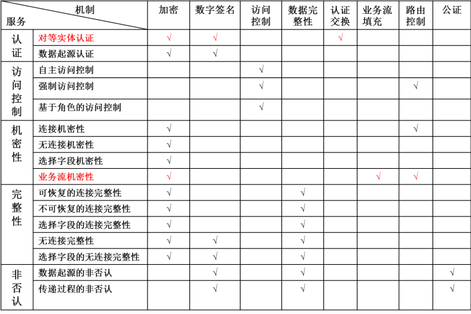

# 绪论

## 信息的定义
- 信息是用来消除随机不定性的东西。
- 信息是事务的存在方式或运动状态，以及这种方式或状态直接或间接的表法。

## 信息安全的定义
为数据处理系统建立和采取的技术和管理的安全保护。

## 信息系统的定义
为信息生命周期提供服务的各类软件的总称。

## 信息安全的三要素
- 机密性（Confidentiality），防止未经授权使用信息。
- 完整性（Integrity），防止对信息的非法修改和破坏。
- 可用性（Availability），确保及时可靠地使用信息。

## 信息安全的其他特性
- 可控制性（Controllability），对信息的传播及内容具有控制能力。
- 不可否认性（Non-repudiation），要求无论发送方还是接收方都不能抵赖所进行的传输。
- 真实性（Truth），对信息的来源进行判断，能对伪造来源的信息予以鉴别。
- 可审查（Accountability），确保实体的活动可被跟踪。
- 可靠性（Reliability），系统在规定的条件下和规定的时间内完成指定功能的概率。

## 信息安全问题产生的根源
- 内因：信息系统的复杂性（过程复杂、结构复杂、应用复杂）。
- 外因：认为和环境（威胁和破坏）。

## 安全威胁的分类
- 从威胁来源分类：内部威胁、外部威胁。
- 从攻击者的行为分类：主动威胁、被动威胁。
- 从威胁的动机分类：偶发性威胁、故意性威胁。

## 计算机安全的核心思想
预防、检测和减少计算机系统（软件/硬件）受自然和人为有害因素的威胁和危害。

## 安全体系结构的定义
- 用于防御安全攻击的硬件或者软件方法、方案或系统。
- 对信息和信息系统安全功能的抽象描述，从整体上定义信息及信息系统所提供的安全服务、安全机制及各种安全组件之间的关系和交互。

## X.800规定的安全服务
- 认证（Authentication），为通信过程中的实体和数据来源提供鉴别服务。
- 访问控制（Access Control），保护受保护的资源不被非授权访问。
- 机密性（Confidentiality），保护数据不被非授权泄漏。
- 完整性（Integrity），确保接收方接收到的数据是发送方所发送的数据。
- 不可抵赖性（Non-Repudiation），防止通信中的任一实体否认它过去执行的某个操作或者行为。

## X.800规定的安全机制
- 加密（Encryption），为数据、通信业务流信息提供机密性，还为其他安全机制提供支撑。
- 数字签名（Digital Signatures），签名技术的数字化。
- 访问控制（Access Control），保护受保护的资源不被非授权访问。
- 完整性（Integrity），确保接收方接收到的数据是发送方所发送的数据。
- 认证交换（Authentication Exchange），在认证者和被认证者之间共享某些信息实现认证。
- 业务填充（Traffic Padding），发送额外数据掩盖正常通信流量特征，保护业务流机密性。
- 路由控制（Routing Control），控制路由过程进行安全保护。
- 公证机制（Notarization），利用可信第三方来实现安全功能。

## 安全服务与安全机制的关系
- 安全服务由安全机制来实现。
- 多对多的关系（一种安全机制可以实现一种或者多种安全服务，一种安全服务可以由一种或者多种安全机制来实现）。

## 在各层提供安全服务优劣对比
### 应用层提供
- 适用位置：在通讯两端的主机系统上实施。
- 优点：
  1. 安全策略和措施通常基于用户制定。
  2. 对用户想要保护的数据具有完整的访问权，对数据的实际含义有着充分的理解，能方便地提供一些服务。
  3. 内容过滤，选择字段加密。
  4. 不必依赖操作系统提供服务，由应用提供。
- 缺点：
  1. 效率太低。
  2. 对现有系统的兼容性太差（要求应用提供）。
  3. 改动的程序太多，出错概率大，带来更多的安全漏洞。
### 传输层提供
- 适用位置：在通讯两端的主机系统上实施。
- 优点：
  1. 能为其上的各种应用提供安全服务。
  2. 提供基于进程对进程的安全服务。
  3. 现有的、未来的应用可以很方便地得到安全服务。
- 缺点：传输层很难获取用户的背景数据，很难针对每个用户的安全需求。
### 数据链路层提供
- 适用位置：在通讯链路两端实施。
- 优点：整个分组都被加密，保密性强。
- 缺点：使用范围有限（只有在专用链路上才能很好地工作），中间不能有转接点。
