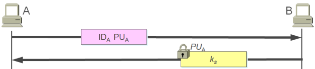
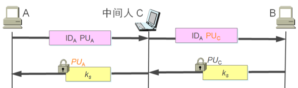
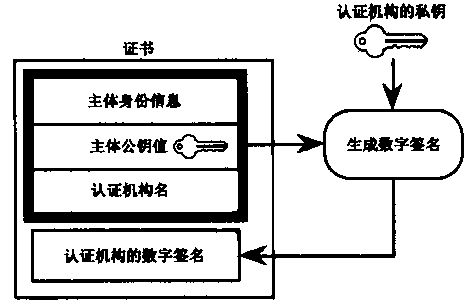

# 密钥管理与分配

## 密钥生命期
- 产生/等级
- 分配
- 使用/启用/停用
- 更新/替换
- 撤销
- 销毁

## 密钥分级
- 初级密钥
    - 加密/解密实际数据。
    - 分类：
        - 初级文件密钥：生命周期与所保护的文件生命周期一样长。
        - 初级通信密钥：生命周期很短，一次密钥使用一次或多次。
    - 由二级密钥加密后传输。
- 二级密钥
    - 保护初级密钥。
    - 由主密钥加密后通过互联网自动传输。
- 主密钥
    - 保护二级密钥。
    - 人工分配，由专职密钥分配人员分配并由专职人员妥善安装。

## 密钥分配方式分配密钥
- 主流方式：
    1. KDC与每个用户共享一个密钥加密密钥（二级密钥）；
    2. 用户向KDC申请会话密钥；
    3. KDC生成会话密钥；
    4. KDC用密钥加密密钥加密会话密钥分发给用户。
- 优点：用户不保存工作密钥，可实现一报一密。
- 缺点：通信量大，需较好的鉴别功能，以识别KDC和用户。

## 利用公钥密码体制来分配密钥
- 主流方式：
    1. A向B发送自己产生的公钥和A的身份；
    2. B收到消息后，产生会话密钥Ks，用A的公钥加密后传送给A；
    3. A用自己的私钥解密后得到Ks。
- 存在的问题：冒充。

## 公钥证书
- 数据结构：用户标识、用户公钥、CA签名。
- 存储与分配：无需保护措施，用户通过交换公钥证书来交换各自公钥。
- 证书形式：时间戳T保证证书的时效性，防止重放旧证书。
- 证书类型：
    1. 签名证书——对用户信息进行签名，确保不可否认性；
    2. 加密证书——对用户传输信息进行加密，确保真实性、完整性。

    
## 证书机构
- CA（Certificate Authority），可信的第三方实体，国际认定的权威机构。负责用户密钥或证书的发放、更新、废止、认证等管理工作。
- 功能：
    1. 颁发证书——检查公钥是否合法、审查认证实体的身份；
    2. 废除证书；
    3. 证书更新——私钥泄漏或证书过期，用户申请更新私钥和更新证书，并废除原证书；
    4. 证书验证——验证有效性、可用性、真实性；
    5. 密钥管理——密钥产生、备份与恢复以及密钥更新。

---
to be continued. 未完待续...
