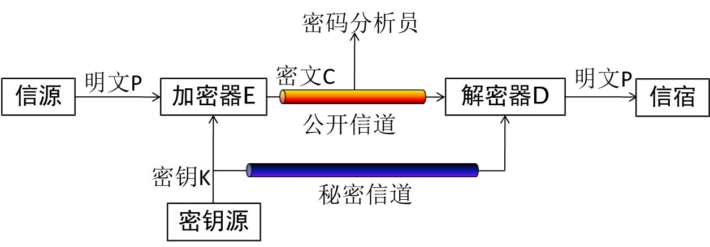
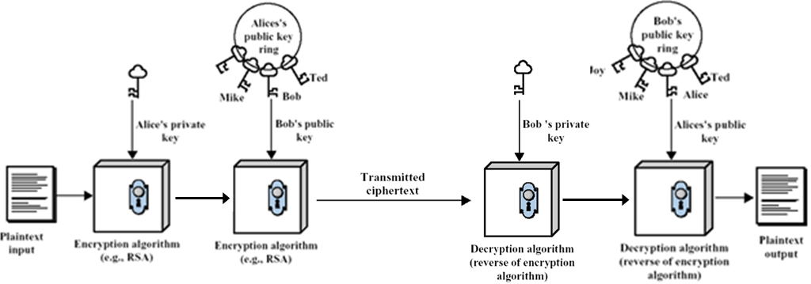
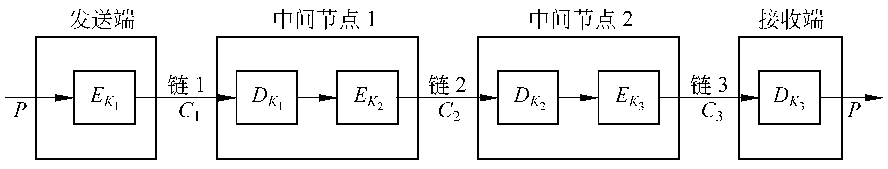
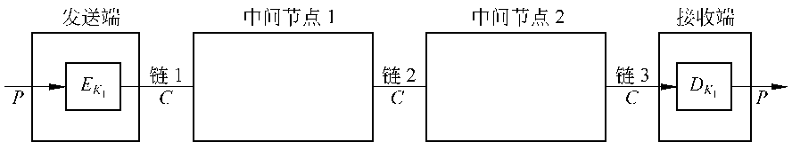

# 密码学基础

## 典型加密技术
- 代换（Substitution）：明文内容的表示形式改变，内容元素之间相对位置不变；明文字母用密文中对应字母代替。
- 置换（Transposition or Permutation）：明文内容元素的相对位置改变，内容的表示形式不变。
- 乘积密码（Product Ciphers）：多个加密技术的叠加。

## 加密通信模型

## 密码算法的安全性
- 无条件安全（Unconditionally Secure）：无论破译者有多少密文,他也无法解出对应的明文,即使他解出了,他也无法验证结果的正确性。
- 计算上安全（Computationally Secure）：破译的代价超出信息本身的价值；破译的时间超出了信息的有效期。
- 可证明安全性：密码算法的安全性依赖于复杂问题，如大数分解、背包问题。

## 对称密钥体制
- 通信双方需要一对密钥。
- n个用户之间通信需要的密钥数为：(n*(n-1))/2。
- n个用户中的某个用户需要的密钥数为：n-1。
- 对称加密算法无法实现抗抵赖的需求。

## 公钥密码体制
- 通信者保留一个公钥和一个私钥。
- n个用户之间通信需要的密钥数为：2n。
- n个用户中的某个用户需要的密钥数为：n。
- 可用于加密传输和逆向签名。
- 安全基础：数学中的难解问题，如大整数因子分解问题、离散对数问题。
- 算法条件：
	- 产生一对密钥是计算可行的；
	- 已知公钥和明文，产生密钥是计算可行的；
	- 接收方利用私钥来解密密文是计算可行的；
	- 对于攻击者，利用公钥来推断私钥是计算不可行的；
	- 已知公钥和密文，恢复明文是计算不可行的；
	- （可选）加密和解密的顺序可以交换。

## 公钥密码体制实现保密和签名

## 对称密钥和非对称密钥的对比
- 对称密钥：
	- 优点：计算开销小、算法简单、加密速度快。
	- 缺点：规模复杂、通信前安全密钥的交换问题、鉴别困难。
	- 适用范围：大量数据加密。
- 非对称密钥：
	- 优点：密钥数量小、密钥发布不成问题、可用于数字签名。
	- 缺点：密钥尺寸大、加密/解密速度慢。
	- 适用范围：少量数据加密。

## 链到链的加密方式
- 说明：在物理层或者数据链路层实施的加密机制。
- 优点：
	- 通信节点维护加密设施；
	- 对用户透明；能提供流量保密性（加填充）；
	- 密钥管理简单；
	- 可提供主机鉴别（解密鉴别）；
	- 加密/解密是在线。
- 缺点：
	- 数据仅在传输线路上是加密的；
	- 每段链路使用不同的密钥加密/解密，每个节点都需要一套加密/解密设备，开销大。

## 端到端的加密方式
- 说明：在网络层及以上实施的加密机制。
- 优点：
	- 发送端和中间节点上数据都是加密的，安全性好；
	- 能提供用户鉴别；
	- 提供了更灵活的保护手段。
- 缺点：
	- 不能提供流量保密性；
	- 密钥管理系统复杂；
	- 加密是离线的。

